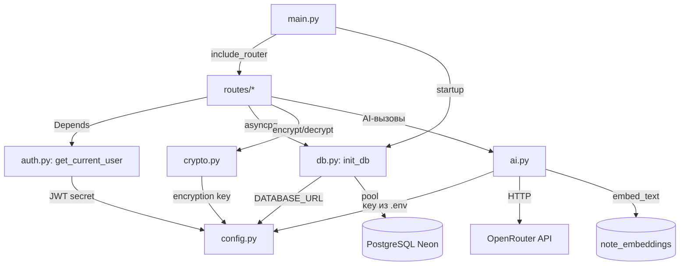
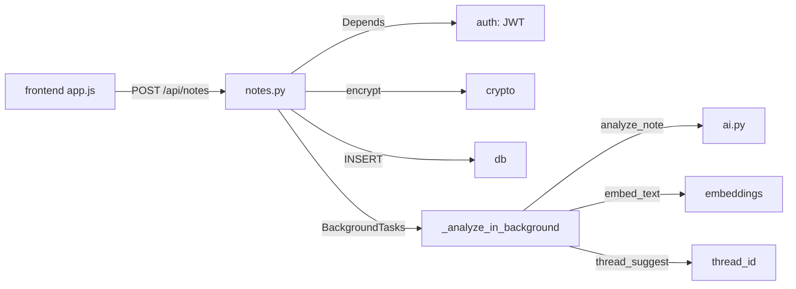

# Curator v3 — техническая карта (mindmap)

> Как устроено нутро: из каких частей состоит и как связаны.
> Проверено по коду 07.08.2026.

## 1. Ментальная карта частей

```mermaid
mindmap
  root((Куратор v3))
    Фронтенд
      index.html
        навигация: Заметки/Цели/Карта/Сон/Куратор/Паттерны
        auth-оверлей
        goalsSection
        tasksSection (скрыт, но в DOM)
      js/app.js
        рендер всех разделов
        API-клиент (fetch)
        esc() защита от XSS
        Hotkey "d" → Цели
      css/
        base layout mobile
        по секции: notes tasks goals dreams chat daymap patterns
    Бэкенд FastAPI
      main.py
        регистрация роутеров
        CORS (прод + localhost)
        serve frontend (StaticFiles)
      config.py
        чтение .env вручную
        4 ключа
      auth.py
        PBKDF2 пароли
        JWT (HS256, 720ч)
        get_current_user (Depends)
      crypto.py
        Fernet AES
        encrypt/decrypt
      db.py
        asyncpg пул
        init_db: схемы+миграции
        get_db / get_pool
      ai.py
        call_ai / call_ai_json
        ротация FREE_MODELS (6 шт)
        GOALS_PROMPT + generate_goals
        эмбеддинги embed_text
      routes/
        notes.py: CRUD+threads+reanalyze+related
        tasks.py (жив, из UI скрыт)
        dreams.py
        chat.py: сессии+search+архив
        goals.py
        insights.py: daily+day-map+essence
        favorites.py
        backup.py
        health.py
    База данных PostgreSQL
      users
      notes (+ai_* поля, thread_id, mood)
      note_embeddings (pgvector 2048)
      tasks
      dreams
      chat_history (session_id)
      goals
      day_essences
    Внешние сервисы
      OpenRouter
        chat: 6 free-моделей
        embeddings: nemotron-3-embed
      Neon PostgreSQL (Railway)
    Деплой Railway
      Dockerfile
      railway.json
      .railwayignore
```

## 2. Взаимосвязи модулей (backend)



## 3. Путь запроса (пример: создать заметку)



## 4. Ключевые факты связей

- **Все роуты** принимают `user_id` из JWT через `get_current_user` — ни один запрос не идёт мимо auth.
- **Шифрование** — только поля `*_encrypted` (notes.content, tasks, dreams); `ai_*` поля, goals, chat_history — открытый текст.
- **AI идёт через `call_ai_json`** (2 прохода × 6 моделей, валидация JSON) — без него данные в БД не пишутся.
- **Фоновые задачи** (BackgroundTasks): переанализ заметки, генерация целей, essence дня — не блокируют ответ.
- **pgvector** используется только в `/api/notes/related` (Heads Up). Семантический поиск в UI пока не подключён — поиск через LIKE в chat.py.
- **tasks** — таблица и роут живы, но из навигации скрыты (GOALS-решение).
- **day_essences** — UPSERT по `(user_id, date)`, заполняется фоном по запросу карты дня.
- **Chat** — сессии: session_id живёт 2 часа, потом новая; история 40 последних строк уходит в контекст AI.

## 5. Сводная таблица роутов

| Префикс | Файл | Что делает |
|---|---|---|
| `/api/notes` | notes.py | CRUD заметок, threads, reanalyze, related (похожие) |
| `/api/tasks` | tasks.py | задачи (скрыты из UI) |
| `/api/dreams` | dreams.py | сны, инсайты, паттерны |
| `/api/chat` | chat.py | `/ai/chat`, `/search`, сессии, архив |
| `/api/goals` | goals.py | CRUD целей, generate (фон), pin |
| `/api/insights` | insights.py | daily, day-map, essence |
| `/api/favorites` | favorites.py | избранное |
| `/api/backup` | backup.py | выгрузка всех данных (JSON) |
| `/api/health` | health.py | проверка для Railway |
| `/api/register` `/api/login` `/api/me` | main.py | auth-эндпоинты |
